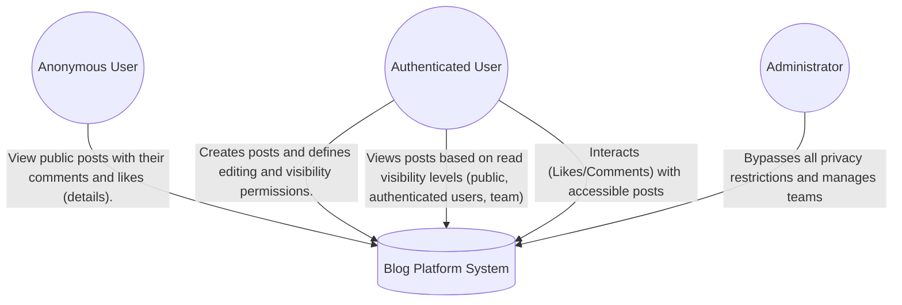
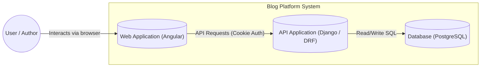

# Blog Platform API

## Project Name
blog_project

## Project Description
blog_project is a RESTful API built with **Django** and **Django Rest Framework** that implements a blogging platform with authentication, team-based permissions, likes, comments, and administrative control.

The project focuses on correct permission handling, clean architecture, and 100% test coverage for mission-critical logic.

## Architecture (C4 Model)

### Level 1: System Context
This diagram shows how different users interact with the Blog API and external services.

### Level 2: Containers View
This diagram ilustrates the internal parts of the system and how the Backend (Django) serves the Frontend (Angular) and persists data.

## Tech Stack
- Python 3.12.3
- Django 6.0
- Django Rest Framework
- PostgreSQL
- pytest / pytest-django
- drf-nested-routers
- drf-spectacular

## Authentication
Authentication is handled using cookies.
Users can register, log in, and log out.
Protected endpoints require authentication unless explicitly public.

## Core Concepts

### Users and Teams
- Each user belongs to exactly one team.
- Users can change teams.
- Permissions are evaluated dynamically.
- When a user changes teams, they lose access to posts from the previous team.
- Only the current team determines access.

### Roles
- Admin users can read and edit any post and bypass permission restrictions.
- Regular users are subject to post permissions.

## Blog Posts
Each post includes:
- Author (automatically set from logged-in user)
- Title
- Content
- Excerpt (first 200 characters)
- Created and updated timestamps
- Read permissions
- Write permissions

## Permissions System
Read and write permissions are independent.

Available levels:
- Public: anyone can access
- Authenticated: any logged-in user
- Team: users in the author's team
- Author: only the author

Rules:
- Admins bypass restrictions.
- Team permissions do not apply if the author is in the Default team.
- Object-level permission checks are enforced.

## API Endpoints

### Authentication
POST /api/users/register/
POST /api/users/login/
POST /api/users/logout/

### Posts
GET /api/posts/
POST /api/posts/
GET /api/posts/{post_id}/
PUT /api/posts/{post_id}/
PATCH /api/posts/{post_id}/
DELETE /api/posts/{post_id}/

- List returns only accessible posts.
- Detail returns 404 if no read access.
- Pagination: 10 posts per page.

### Comments
GET /api/posts/{post_id}/comments/
POST /api/posts/{post_id}/comments/
GET /api/posts/{post_id}/comments/{comment_id}/
DELETE /api/posts/{post_id}/comments/{comment_id}/

Rules:
- Authentication required.
- User must have read access.
- Users can delete only their own comments.
- Pagination: 10 comments per page.

### Likes
POST /api/posts/{post_id}/likes/
DELETE /api/posts/{post_id}/likes/unlike/

Rules:
- Authentication required.
- User must have read access.
- One like per user per post.
- Pagination: 20 likes per page.

## Deletion Rules
- Only users with edit permission can delete posts.
- Deleting a post removes all related comments and likes.

## Testing
- Tests written with pytest.
- Organized by models, permissions, serializers, and viewsets.
- Covers edge cases including team changes and permission updates.

Run tests:
pytest

## Database
- PostgreSQL
- Cascade deletions enforced.
- Unique constraint on likes.

## Installation

1. Clone repository
git clone <repository-url>

2. Create virtual environment
python -m venv .venv
source .venv/bin/activate

3. Install dependencies
pip install -r requirements.txt

4. Apply migrations
python manage.py migrate

5. Run server
python manage.py runserver

## API Documentation
Generated with drf-spectacular:
/api/schema/
/api/docs/

## Author
Luisa Fernanda Alvarez Villa
