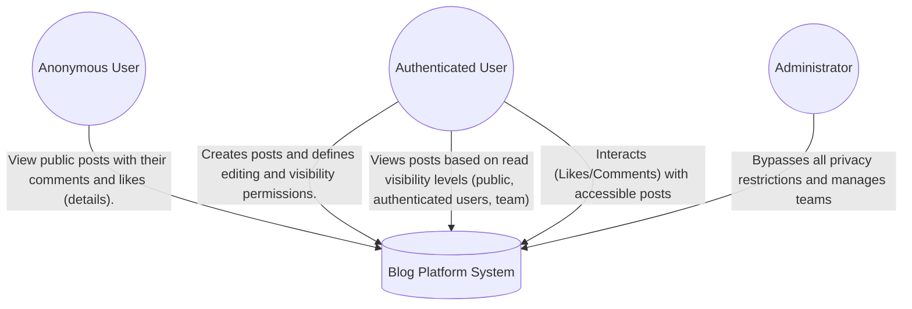
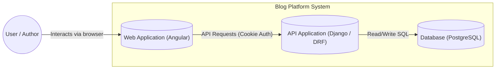
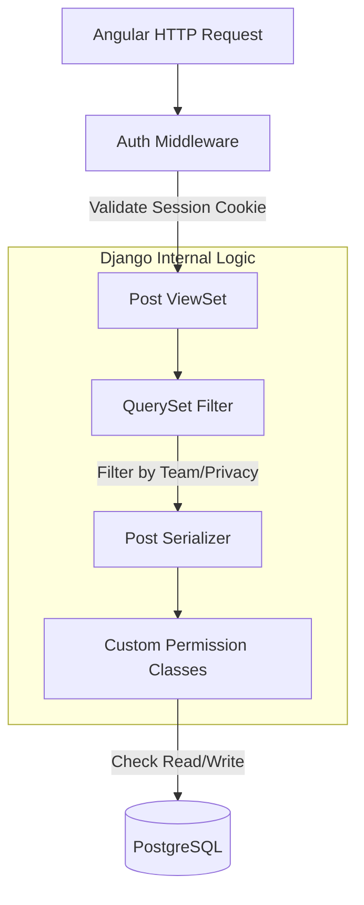
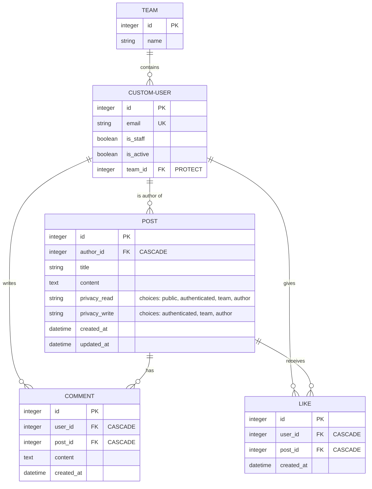

# Blog Platform API

## Project Name
blog_project

## Project Description
blog_project is a RESTful API built with **Django** and **Django Rest Framework** that implements a blogging platform with authentication, team-based permissions, likes, comments, and administrative control.

The project focuses on correct permission handling, clean architecture, and 100% test coverage for mission-critical logic.

## Architecture (C4 Model)

### Level 1: System Context
This diagram shows how different users interact with the Blog API and external services.

### Level 2: Containers View
This diagram ilustrates the internal parts of the system and how the Backend (Django) serves the Frontend (Angular) and persists data.


### Level 3: Component View (API Logic)
This level shows how the Django API handles a request. It highlights the Permission Layer, which is the core of the business logic.

###Database Design (ERD)
This diagram represents the relational structure and how content is linked to users and teams.


## Authentication & Core Concepts

### Authentication
- Authentication is handled using **secure cookies**.
- Users can register, log in, and log out.
- Protected endpoints require authentication unless explicitly public.

### Users and Teams
- Each user belongs to exactly one team.
- Only administrators can change team assignments.
- Permissions are evaluated dynamically.
- Access Control: When a user changes teams, they lose access to posts from the previous team, and only the current team determines access. The user’s posts are transferred to the new team and do not remain with the former team.

### Roles
- Admin: Can read and edit any post and bypass all permission restrictions.
- Regular Users: Subject to post-level permissions.

## Permissions System
Read and write permissions are independent.

Available levels:
- Public: anyone can access
- Authenticated: any logged-in user
- Team: users in the author's team
- Author: only the author

Rules:
- Admins bypass restrictions.
- Team permissions do not apply if the author is in the Default team.
- Object-level permission checks are enforced.

## Blog Posts
Each post includes:
- Author (automatically set from logged-in user)
- Title
- Content
- Excerpt (first 200 characters)
- Created and updated timestamps
- Read permissions
- Write permissions

## API Endpoints

### Authentication
| Method | Endpoint | Description |
| :--- | :--- | :--- |
| `POST` | `/api/users/register/` | Register a new user |
| `POST` | `/api/users/login/` | User login (Sets Session Cookie) |
| `POST` | `/api/users/logout/` | User logout |

### Posts
* `GET /api/posts/`
* `POST /api/posts/`
* `GET /api/posts/{id}/`
* `PUT /api/posts/{id}/`
* `PATCH /api/posts/{id}/`
* `DELETE /api/posts/{id}/`

> **Note:** The list endpoint returns only accessible posts. Detail endpoints return **404** if the user lacks read access. Pagination is set to **10 posts per page**.

### Comments & Likes
* **Comments:** `GET/POST` at `/api/posts/{id}/comments/`. Only users with read access can comment.
* **Likes:** `POST` at `/api/posts/{id}/likes/`. Restricted to one like per user per post.

---

## 🛠 Tech Stack & Database
* **Stack:** Python 3.12.3, Django 6.0, Django REST Framework, PostgreSQL.
* **Testing:** `pytest` / `pytest-django`. Covers models, permissions, and complex edge cases.
* **Database Rules:** * Cascade deletions enforced for all related content.
    * Unique constraints on likes to prevent duplicates.

---

## 🚀 Installation

1. **Clone the repository:**
   ```bash
   git clone https://github.com/Lufal-lab/Blog-Backend.git
   ```
2. **Create and activate virtual environment:**
   ```bash
   python -m venv .venv
   source .venv/bin/activate
   ```
3. **Install dependencies & apply migrations:**
   ```bash
   pip install -r requirements.txt
   python manage.py migrate
   ```
4. **Run the development server:**
   ```bash
   python manage.py runserver
   ```
   
## API Documentation
The API is fully documented and interactive using drf-spectacular:
- OpenAPI Schema: `/api/docs/schema/`
- Swagger UI: `/api/docs/swagger/`
- ReDoc: `/api/docs/redoc/`

## Author
Luisa Fernanda Alvarez Villa
